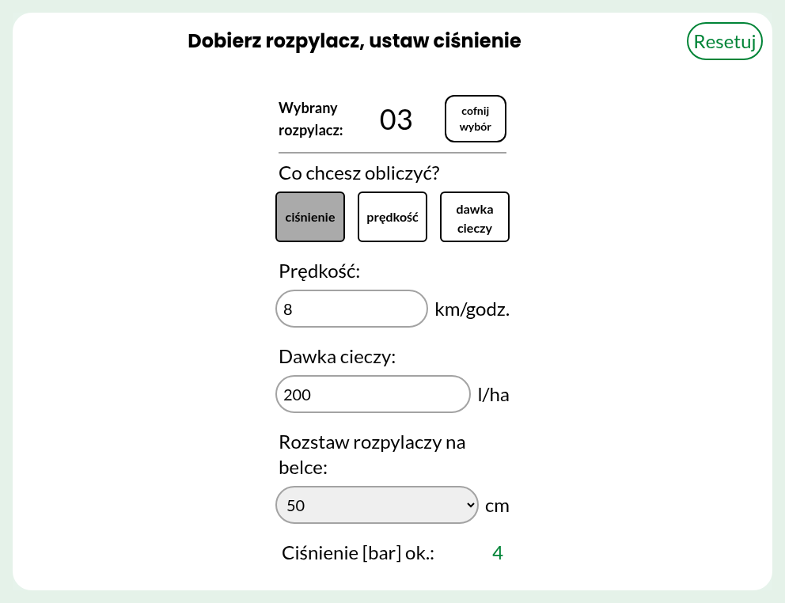
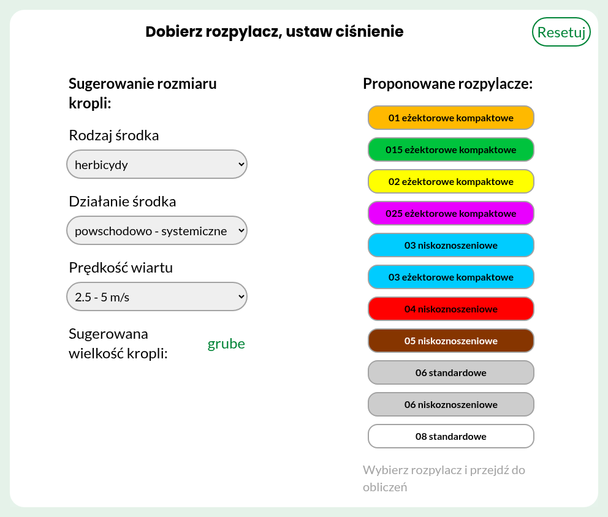
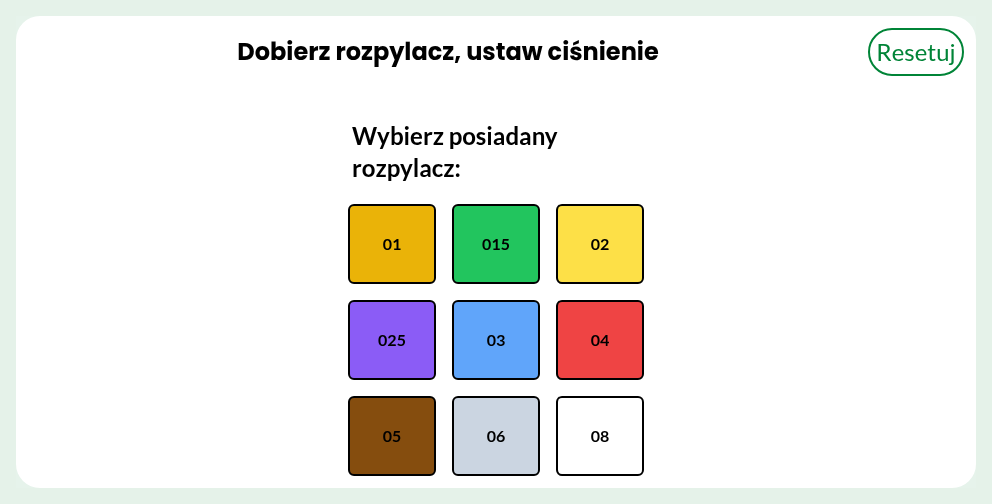

# Nozzle Selection Calculator

A web app for choosing sprayer nozzles and setting their parameters, built for [topagrar.pl](https://www.topagrar.pl/). It works in two stages: first select a nozzle, then calculate the pressure, speed or spray volume for it.



## Requirements

- [Node.js](https://nodejs.org/)

A Nix flake (`flake.nix`) is also provided for a reproducible environment with Node.js:

```sh
nix develop
```

## Features

- **Stage 1: nozzle selector** – get nozzles proposed for the treatment conditions, or pick a nozzle you already have.
- **Stage 2: parameter selector** – for the selected nozzle, calculate parameters - one of: pressure, driving speed or spray volume.

### Stage 1: nozzle selector

There are two ways to select a nozzle.

**Choosing a nozzle for the treatment conditions** (`Wybór rozpylacza do warunków zabiegu`). Choosing the product type, its action and the wind speed gives a droplet size, from fine (`drobne`) to very coarse (`bardzo grube`). The nozzles that produce it are listed next to it, each in the colour of its size.



**Using a nozzle you already have** (`Mam już rozpylacz i chcę dobrać parametry`). Pick its size from the grid. The buttons use the ISO colour of each size.



Clicking a nozzle in either view moves to stage 2.

### Stage 2: parameter selector

Choose what to calculate pressure (`ciśnienie`), driving speed (`prędkość`) or spray volume (`dawka cieczy`), fill in the other two values and the nozzle spacing. The result updates as you type.

## File structure

- `src/index.html` – the page: header, the start choice and the sections for droplet size, proposed nozzles, nozzle selection and the calculator.
- `src/script.js` – the data tables, showing and hiding sections, input formatting and the calculations.
- `src/input.css` – Tailwind CSS source; `src/output.css` is the compiled stylesheet.
- `tailwind.config.js` – Tailwind configuration with the topagrar colours and fonts.
- `docs/` – screenshots for this README.
